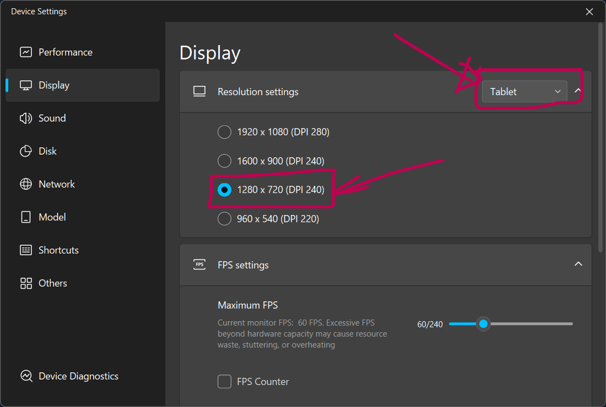
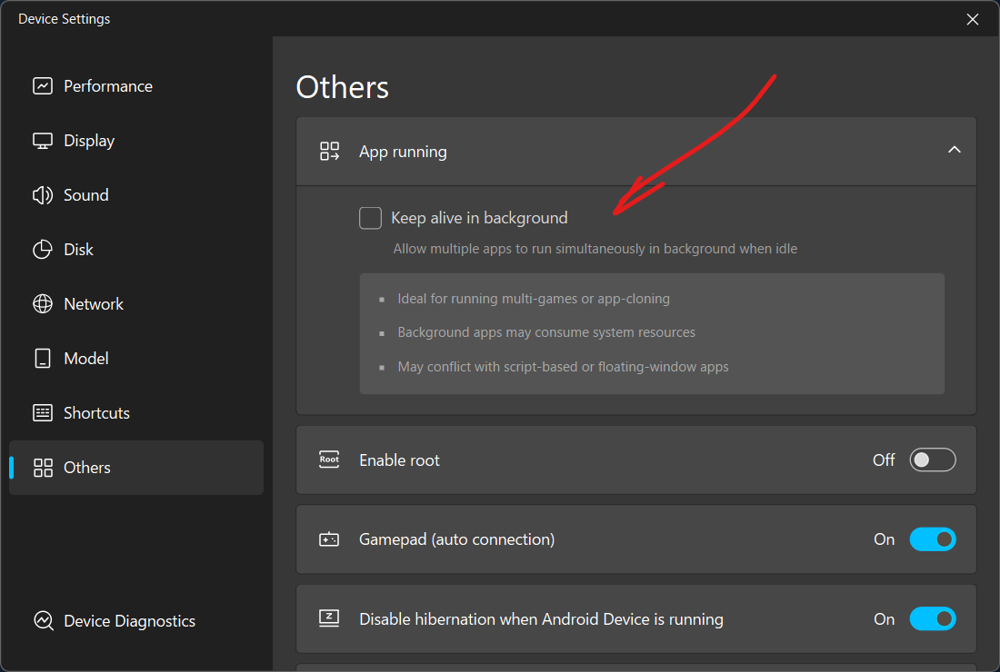
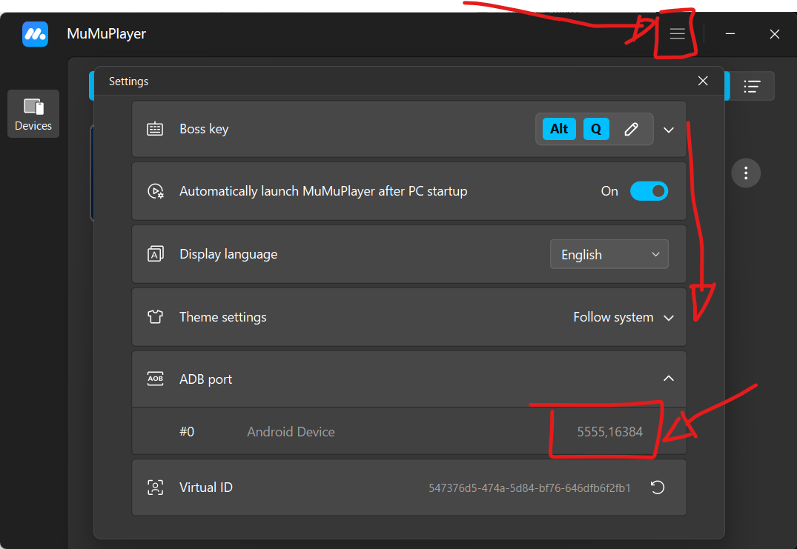

import { Steps, Aside } from '@astrojs/starlight/components';

This guide shows the minimal emulator settings needed to run the Blue Archive Resources Scanner.

**Prerequisite:** Install an Android emulator and Blue Archive inside it. The scanner expects a **1280×720** resolution.

<Steps>

1. **Set emulator resolution and mode**

   Open your emulator settings. Select `Tablet Mode` and set the resolution to `1280x720`.

   

2. **Enable ADB on the emulator**

   If you're using BlueStacks or LDPlayer, enable the emulator's ADB setting so the host can connect.

3. **MuMu Player-specific: disable Keep Alive in Background**

   If you're using MuMu Player 12 (or V5.8.4 as of writing), open the instance manager and turn off `Keep alive in background` for the Blue Archive instance.

   

4. **Find the emulator serial**

   The ADB serial is usually shown in the instance manager (upper-right corner) or in the emulator's multiplayer/instance list. Use that serial when specifying `ADB_HOST` / `ADB_PORT`.

   

5. **Run the Launcher Wizard**

   Start the scanner with:
   ```bash
   python launch.py
   ```
   The wizard will prompt you for your platform, ADB host/port, and scan targets. It saves everything automatically to `config/settings.json` - no manual `config.py` edits required.

</Steps>

<Aside>
  The scanner assumes the game is in the 1280×720 layout with no extra UI overlays or DPI scaling. If your emulator supports multiple graphics/DPI profiles, choose the one that matches standard tablet mode.
</Aside>

## Credits

[AzurLaneAutoScript Wiki](https://github.com/LmeSzinc/AzurLaneAutoScript/wiki):
- [Configure Emulator](https://github.com/LmeSzinc/AzurLaneAutoScript/wiki/Installation_en#configure-emulator)
- [Configure Alas](https://github.com/LmeSzinc/AzurLaneAutoScript/wiki/Installation_en#configure-alas) - for getting serial values for `ADB_HOST` and `ADB_PORT`